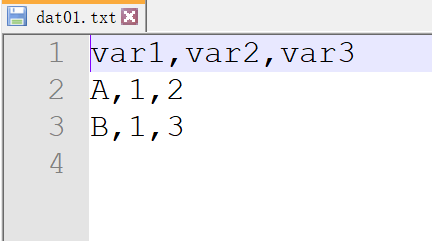
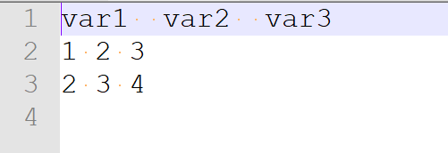
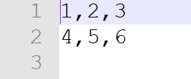
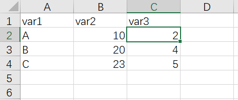

# 绘图数据准备

我们准备数据最常用的有两种选择：

- 一是文本文件存储数据
- 另外就是使用excel来准备数据

如果能够用电脑上的记事本打开查看里面的内容没有乱码，都是文本文件，不管文件的后缀名是txt csv tsv或者其他，这里推荐的文本编辑器是notpad++，这个打开文本文件很好用

## 文件的路径

首先是数据存储的路径，路径就是指数据存储到了电脑的哪个文件夹，以win系统电脑为例就是 `盘符:/文件夹/文件/` 比如 `D:/xiaoming/data.csv`，路径分为

- 绝对路径
- 相对路径

绝度路径就是从盘符开始写的这种，相对路径是相对于当前的工作目录你自己的数据存储在哪里，这个相对路径的概念刚开始理解起来可能不是很好理解，初学者我建议大家还是采用绝对路径的写法

## 读取数据

如果是文本文件的数据，R语言读取的时候可以直接使用`read.table()`函数,这个函数接受三个参数，

- 一个是数据文件的存储路径 `file=`

- 一个是数据文件里的分隔符号 `sep=`

分隔符号比较常用的是逗号和制表符,如果是逗号分隔的文件可以把文件的后缀名直接更改为.csv这样可以直接双击用excel打开，如果是制表符分隔的文件，可以把后缀名改成.tsv

- 还有一个参数是数据文件是否有表头 `header=` 等于号后面写TRUE或者FALSE,TRUE就是有表头，FALSE就是没有表头

以如下数据集为例,逗号作为分隔符



文件里每行元素之间是用逗号分隔，第一行是数据集的表头，读取数据的命令是

```{r}
dat01 <- read.table(file = "D:/Bookofggplot2/PracticalHandbookforggplot2/example_data/02-preparedata/dat01.txt",header = TRUE,sep=",")
dat01
```

这里
- `read.table()`里的内容是读取数据

- `<-` 这个符号是赋值

- `dat01`是给读取进来的数据集起个名字 这个名字可以自己随便起，只要以字母开头就行

如下数据为例，制表符作为分隔符，制表符的表示方式是`\t`



文件里每行元素之间是用逗号分隔，第一行是数据集的表头，读取数据的命令是

```{r}
dat02 <- read.table(file = "D:/Bookofggplot2/PracticalHandbookforggplot2/example_data/02-preparedata/dat02.txt",header = TRUE,sep="\t")
dat02
```

如果数据集没有表头，我们将header参数指定为FALSE



```{r}
dat03 <- read.table(file = "D:/Bookofggplot2/PracticalHandbookforggplot2/example_data/02-preparedata/dat03.txt",header = TRUE,sep=",")
dat03
```

常用的分隔符号还有空格，如果空格作为分隔符的话，我们需要把sep=后面的双引号里直接敲一个空格就行了

因为逗号是非常常用的分隔符，R语言也提供了专门针对这种分隔符的读取数据函数`read.csv()`，但是作为初学者我建议大家还是直接使用`read.table()`函数，熟练了以后再探索其他数据读取函数

> 以上内容介绍的是读取文本文件的数据

如果想要读取excel存储的数据，一个办法是将excel转换为csv文件，然后通过`read.table()`函数来读取

另外的方式就是安装R包`readxl`,这个R包里有可以直接读取excel文件的函数`read_excel()`,直接运行`install.packages("readxl")`命令联网就可以安装。`read_excel()`读取数据的时候一般需要准备两个参数，一个是`path`数据文件的路径，另外一个是`col_names`数据集是否有表头

示例数据集如下



这里需要注意一点是`readxl`这个R包每次使用都要运行`library(readxl)`加载这个R包

```{r}
library(readxl)
dat04 <- read_excel(path = "D:/Bookofggplot2/PracticalHandbookforggplot2/example_data/02-preparedata/dat04.xlsx",col_names = TRUE)
dat04
```
