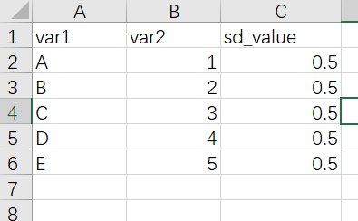

# R语言ggplot2柱形图

## 最基本的柱形图需要准备的数据

一列x一列y

- 如果柱子垂直 x是离散型数据 y是连续型数据

```{r echo=FALSE, warning=FALSE}
library(readxl)
dat01<-read_excel("example_data/04-barplot/dat01.xlsx")
library(ggplot2)
ggplot(data=dat01,aes(x=var1,y=var2))+
  geom_col()
```

- 如果想要水平的柱子，就把y设置成离散数据，x设置成连续数据

```{r echo=FALSE, warning=FALSE}
library(readxl)
dat01<-read_excel("example_data/04-barplot/dat01.xlsx")
library(ggplot2)
ggplot(data=dat01,aes(x=var2,y=var1))+
  geom_col()
```

- 数据集

```{r warning=FALSE, echo=FALSE}
library(readxl)
dat01<-read_excel("example_data/04-barplot/dat01.xlsx")
knitr::kable(dat01, "simple")
```

读取数据集
```{r}
library(readxl)
dat01<-read_excel("example_data/04-barplot/dat01.xlsx")
head(dat01)
```

作图代码

> 柱形图的函数有`geom_col()`和`geom_bar()`,具体有什么区别我没有仔细研究过，我自己习惯用`geom_col()`函数，做堆积柱形图和簇状柱形图的时候会使用`geom_bar()`函数

```{r}

```

柱形图可以修改的参数分别是

- `color`对应柱子的边框颜色
- `size` 对应是边框的粗细
- `fill`对应柱子的填充颜色
- `alpha`对应的是柱子填充颜色的透明度，取值是0到1之间
- `width`对应柱子的宽度

> 看如下代码的效果，你可以试着更改每个参数的值

```{r}
library(readxl)
dat01<-read_excel("example_data/04-barplot/dat01.xlsx")
head(dat01)
library(ggplot2)
ggplot(data=dat01,aes(x=var1,y=var2))+
  geom_col(color="red",size=3,
           fill="blue",alpha=0.5,
           width = 0.2)
```

如果统一修改边框颜色，填充颜色这些属性，比如上面的例子，5个柱子全都设置成一样的，就把参数设置到`aes()`的外面。如果想要用数据中的某一列来映射颜色。需要把参数写到`aes()`的里面。

柱形图还有一个比较常用的操作是添加误差线，这里假设已经算好了标准差，我们将标准差整理到数据集里，格式如下



添加误差线的函数是`geom_errorbar()`

如果是垂直与x轴的误差线，需要制定ymin和ymax两个参数

作图代码

```{r}
library(readxl)
dat01<-read_excel("example_data/04-barplot/dat01_1.xlsx")
head(dat01)
library(ggplot2)
ggplot(data=dat01,aes(x=var1,y=var2))+
  geom_col()+
  geom_errorbar(aes(ymin=var2-sd_value,
                    ymax=var2+sd_value))
```

误差线函数比较常用的三个参数是

- width 调节误差线的宽度
- color 误差线的颜色
- lty 线的类型，就是实线 虚线 这些

更改这三个参数

```{r}
library(readxl)
dat01<-read_excel("example_data/04-barplot/dat01_1.xlsx")
head(dat01)
library(ggplot2)
ggplot(data=dat01,aes(x=var1,y=var2))+
  geom_col(fill="grey")+
  geom_errorbar(aes(ymin=var2-sd_value,
                    ymax=var2+sd_value),
                color="red",
                width=0.4,
                lty="dashed")
```

柱形图还有一个比较常用的操作是组间比较，做统计检验后添加p值或者显著性的星号，这里还是假设已经做好了统计检验，这里使用`annotate()`函数来添加线段和文本。这里有一个知识点是如果是离散数据作为x轴，第一个柱子的横坐标是1,第二个第三个依次是2，和3 这样

首先是`annotate()`函数添加添加文本，需要制定四个内容，

- 添加注释的类型 文本是geom = "text"
- 添加文本的位置 一个 x 和一个 y
- 添加文本的内容 label = "ABC"

如下代码 我在 A B 两个柱子中间 横坐标是1.5 纵坐标3的位置添加一个P value = 0.01的文本,设置文本的颜色为蓝色

```{r}
library(readxl)
dat01<-read_excel("example_data/04-barplot/dat01_1.xlsx")
head(dat01)
library(ggplot2)
ggplot(data=dat01,aes(x=var1,y=var2))+
  geom_col(fill="grey")+
  geom_errorbar(aes(ymin=var2-sd_value,
                    ymax=var2+sd_value),
                color="red",
                width=0.4,
                lty="dashed")+
  annotate(geom = "text",x=1.5,y=3,
           label="P value = 0.01",color="blue")
```

接下来是添加注释的线段，线段需要制定的参数是

- geom="segment"

- 线段的起始位置 x,y 线段的终止位置x y

- 还可以更改颜色 线型 粗细 之类的

看如下代码

```{r}
library(readxl)
dat01<-read_excel("example_data/04-barplot/dat01_1.xlsx")
head(dat01)
library(ggplot2)
ggplot(data=dat01,aes(x=var1,y=var2))+
  geom_col(fill="grey")+
  geom_errorbar(aes(ymin=var2-sd_value,
                    ymax=var2+sd_value),
                color="red",
                width=0.4,
                lty="dashed")+
  annotate(geom = "text",x=1.5,y=3,
           label="P value = 0.01",color="blue")+
  annotate(geom = "segment",x=1,y=1.5,xend=1,yend=2.8,
           color="black",size=1)
```

接下来再来添加两个线段

```{r}
library(readxl)
dat01<-read_excel("example_data/04-barplot/dat01_1.xlsx")
head(dat01)
library(ggplot2)
ggplot(data=dat01,aes(x=var1,y=var2))+
  geom_col(fill="grey")+
  geom_errorbar(aes(ymin=var2-sd_value,
                    ymax=var2+sd_value),
                color="red",
                width=0.4,
                lty="dashed")+
  annotate(geom = "text",x=1.5,y=3,
           label="P value = 0.01",color="blue")+
  annotate(geom = "segment",x=1,y=1.5,xend=1,yend=2.8,
           color="black",size=1)+
  annotate(geom = "segment",x=2,y=2.5,xend=2,yend=2.8,
           color="black",size=1)+
    annotate(geom = "segment",x=1,y=2.8,xend=2,yend=2.8,
           color="black",size=1)
```

用这个annotate()函数相对来说会比较繁琐，如果要添加比较多的线段的话代码会很长，但是这个可定制性比较强，我目前还想不到其他比较合适的替代方案

## 簇状柱形图

参考链接 https://r-graph-gallery.com/48-grouped-barplot-with-ggplot2.html

数据格式如下

```{r warning=FALSE, echo=FALSE}
library(readxl)
dat01<-read_excel("example_data/04-barplot/dat02_grouped_barplot.xlsx")
knitr::kable(dat01, "simple")
```

作图代码

```{r warning=FALSE}
library(readxl)
dat01<-read_excel("example_data/04-barplot/dat02_grouped_barplot.xlsx")
library(ggplot2)
ggplot(data=dat01,aes(x=var1,y=value))+
  geom_bar(stat="identity",
           aes(fill=var2),
           position = "dodge")
```

- 这里`stat="identity"`我一直没有搞清楚是什么意思,记住是必须要写的

- 如果不加`position="dodge"`默认是堆积柱形图

- 堆积柱形图的position应该设置为`position="stack"`


簇状柱形图比较常用的修改参数是

- 不同组之前的显示顺序，默认是首字母
- 组内不同柱子的的排序，默认也是首字母

涉及到顺序的都是调节数据集的因子水平

代码

```{r warning=FALSE}

library(readxl)
dat01<-read_excel("example_data/04-barplot/dat02_grouped_barplot.xlsx")
dat01$var1<-factor(dat01$var1,
                   levels = c("group3","group2","group4","group1"))
library(ggplot2)
ggplot(data=dat01,aes(x=var1,y=value))+
  geom_bar(stat="identity",
           aes(fill=var2),
           position = "dodge")

dat01$var2<-factor(dat01$var2,
                   levels = c("B","C","A"))
ggplot(data=dat01,aes(x=var1,y=value))+
  geom_bar(stat="identity",
           aes(fill=var2),
           position = "dodge")
```

堆积柱形图还有一个经常会遇到的问题是添加误差线，现在假设我们已经把标准差算好了，整理excel里，数据格式如下，在原有数据的基础上添加一列标准差的数据
```{r warning=FALSE, echo=FALSE}
library(readxl)
dat01<-read_excel("example_data/04-barplot/dat02_grouped_barplot_01.xlsx")
knitr::kable(dat01, "simple")
```

- 添加误差线的函数是 `geom_errorbar()`

作图代码

```{r}
library(readxl)
dat01<-read_excel("example_data/04-barplot/dat02_grouped_barplot_01.xlsx")
library(ggplot2)
ggplot(data=dat01,aes(x=var1,y=value))+
  geom_bar(stat="identity",
           aes(fill=var2),
           position = "dodge")+
  geom_errorbar(aes(ymin=value-sd_value,
                    ymax=value+sd_value))
```

- 误差线主要的调节参数就两个，一个是width误差线的宽度，一个是color颜色

```{r,warning=FALSE}
library(readxl)
dat01<-read_excel("example_data/04-barplot/dat02_grouped_barplot_01.xlsx")
library(ggplot2)
ggplot(data=dat01,aes(x=var1,y=value))+
  geom_bar(stat="identity",
           aes(fill=var2),
           position = "dodge")+
  geom_errorbar(aes(ymin=value-sd_value,
                    ymax=value+sd_value),
                width=0.4,
                color="grey")
```

簇状柱形图的误差线全部集中在同一位置，需要我们用参数`position = position_dodge(1)`调节开,这里需要注意一点是如果调节误差线的位置，需要把`fill=var2`参数写到`ggplot`里，`position_dodge()`里面的数值具体应该设置多少我也搞不清楚，每次都要设置好几次

```{r,warning=FALSE}
library(readxl)
dat01<-read_excel("example_data/04-barplot/dat02_grouped_barplot_01.xlsx")
library(ggplot2)
ggplot(data=dat01,aes(x=var1,y=value,fill=var2))+
  geom_bar(stat="identity",
           position = "dodge")+
  geom_errorbar(aes(ymin=value-sd_value,
                    ymax=value+sd_value),
                width=0.4,
                color="blue",
                position = position_dodge(0.9))
```

其他的美化，比如让柱子贴着底，坐标轴标签，更改默认配色等

```{r,warning=FALSE}
library(readxl)
dat01<-read_excel("example_data/04-barplot/dat02_grouped_barplot_01.xlsx")
library(ggplot2)
ggplot(data=dat01,aes(x=var1,y=value,fill=var2))+
  geom_bar(stat="identity",
           position = "dodge")+
  geom_errorbar(aes(ymin=value-sd_value,
                    ymax=value+sd_value),
                width=0.4,
                color="blue",
                position = position_dodge(0.9))+
  scale_y_continuous(expand=expansion(mult=c(0,0.1)))+
  scale_fill_manual(values = c("A"="grey","B"="black","C"="green"))+
  labs(x="AAAAA",y="BBBBB")
```

### 接下来看每周一图里面的例子

这里 `aes()`的内容是可以写到作图函数里，也可以写到ggplot里，这里还是有区别的，比如上面提到的误差线的位置调节

```{r,warning=FALSE,message=FALSE}
library(readr)
success_rates<-read_csv("example_data/04-barplot/success_rates.csv")
library(ggplot2)
ggplot(success_rates) +
  # add bar for each discipline colored by gender
  geom_bar(aes(x = discipline, y = success, fill = gender),
           stat = "identity", position = "dodge") +
  # name axes and remove gap between bars and y-axis
  scale_y_continuous("Success Rate", expand = c(0, 0)) +
  scale_x_discrete("Discipline") +
  scale_fill_manual(values = c("#468189", "#9DBEBB")) +
  # remove grey theme
  theme_classic(base_size = 18) +
  # rotate x-axis and remove superfluous axis elements
  theme(axis.text.x = element_text(angle = 90, 
                                   hjust = 1, vjust = 0),
        axis.line = element_blank(),
        axis.ticks.x = element_blank()) 
```

## 堆积柱形图

堆积柱形图和簇状柱形图的数据格式是一样的，自己的数据具体需要用堆积柱形图还是簇状柱形图自己斟酌，堆积柱形图我们只需要把簇状柱形图对应的`position="dodge"`改成`position="stack"`就可以了

```{r,warning=FALSE}
dat01<-read_excel("example_data/04-barplot/dat02_grouped_barplot.xlsx")
library(ggplot2)
ggplot(data=dat01,aes(x=var1,y=value))+
  geom_bar(stat="identity",
           aes(fill=var2),
           position = "stack")
```

堆积柱形图有一个特点是除了展示真实数据外，还可以展示比例,需要我们把`position="stack"`改成`position="fill"`
```{r,warning=FALSE}
dat01<-read_excel("example_data/04-barplot/dat02_grouped_barplot.xlsx")
library(ggplot2)
ggplot(data=dat01,aes(x=var1,y=value))+
  geom_bar(stat="identity",
           aes(fill=var2),
           position = "fill")
```

接下来就是更改柱子的顺序，和簇状柱形图调节顺序一样，只要更改原始数据的因子水平,默认的顺序是从上往下排的

```{r,warning=FALSE}
library(readxl)
dat01<-read_excel("example_data/04-barplot/dat02_grouped_barplot.xlsx")
dat01$var1<-factor(dat01$var1,
                   levels = c("group3","group2","group4","group1"))
library(ggplot2)
ggplot(data=dat01,aes(x=var1,y=value))+
  geom_bar(stat="identity",
           aes(fill=var2),
           position = "stack")

dat01$var2<-factor(dat01$var2,
                   levels = c("B","C","A"))
ggplot(data=dat01,aes(x=var1,y=value))+
  geom_bar(stat="identity",
           aes(fill=var2),
           position = "stack")
```

- 堆积柱形图添加误差线不常用，但也有人有这个需求，需要对原始数据有一个累加处理用来指定误差线的y坐标
```{r}
library(readxl)
dat01<-read_excel("example_data/04-barplot/dat02_grouped_barplot_01.xlsx")
library(tidyverse)
dat01 %>% 
  group_by(var1) %>% 
  mutate(new_col=cumsum(value)) -> dat01

readr::write_csv(dat01,file="example_data/04-barplot/dat02_grouped_barplot_01.csv")
dat01$var2<-factor(dat01$var2,
                   levels = c("C","B","A"))
ggplot(data=dat01,aes(x=var1,y=value))+
  geom_bar(stat="identity",
           aes(fill=var2),
           position = "stack")+
  geom_errorbar(aes(ymin=new_col-sd_value,
                    ymax=new_col+sd_value),
                width=0.4,
                color="grey")
```

堆积柱形图还有一个经常遇到的问题是在图上添加文字，我们自数据集里添加新的列指定文本标签和文本标签的坐标,

```{r}
library(readxl)
dat01<-read_excel("example_data/04-barplot/dat02_grouped_barplot_02.xlsx")
knitr::kable(dat01, "simple")
```

添加文本用到的函数是`geom_text()`

```{r,warning=FALSE}
dat01<-read_excel("example_data/04-barplot/dat02_grouped_barplot_02.xlsx")
library(ggplot2)
ggplot(data=dat01,aes(x=var1,y=value))+
  geom_bar(stat="identity",
           aes(fill=var2),
           position = "stack")+
  geom_text(aes(x=var1,y=text_y,label=text))
```

美化 更改配色


### 实际例子

```{r}
library(readr)
library(tidyverse)

bechdel_test_df<-read_csv("example_data/04-barplot/bechdel_test_df.csv")
bechdel_test_text <- read_csv("example_data/04-barplot/bechdel_test_text.csv")
bechdel_step_df <- read_csv("example_data/04-barplot/bechdel_step_df.csv")
library(ggplot2)

bechdel_test_df %>% 
  mutate(clean_test = factor(clean_test, 
                             levels = c("ok", "dubious", "men", "notalk", "nowomen")),
         clean_test = fct_rev(clean_test)) %>% 
  ggplot(aes(year_group, category_prop)) +
  geom_col(aes(fill = clean_test), width = 1, color = "white", 
           size = 0.6, show.legend = FALSE) +
  geom_segment(data = bechdel_step_df, 
               aes(x = x_coord, xend = x_end_coord, 
                   y = category_prop, yend = category_prop), 
               size = 1.5) +
  geom_segment(data = filter(bechdel_step_df, year_group != "2010 -\n'13"), 
               aes(x = x_end_coord, xend = x_end_coord, 
                   y = y_coord, yend = y_end_coord), 
               lineend = "round", size = 1.5) +
  geom_segment(aes(x = 0.12, xend = 9.5, y = 0, yend = 0), 
               size = 0.8) +
  geom_segment(aes(x = 0.25, xend = 9.5, y = 1, yend = 1),
               size = 0.8, color = "#cdcdcd") +
  geom_segment(data = tibble(x = 0.12, xend = 0.5, y = c(0.25, 0.5, 0.75)), 
               aes(x = x, xend = xend, y = y, yend = y), 
               size = 0.8, color = "#cdcdcd") +
  geom_text(data = tibble(x = 0, y = c(0, 0.25, 0.5, 0.75, 1), 
                          label = c(0, 25, 50, 75, 100)), 
            aes(x = x, y = y, label = label), 
            family = "serif", size = 6, hjust = 1) +
  geom_text(data = tibble(x = 0.2, y = 1, label = "%"), 
            aes(x = x, y = y, label = label), 
            family = "serif", size = 7, hjust = 1) +
  geom_text(data = tibble(x = c(0.5, 2.5, 4.5, 6.5, 8.5), 
                          y = -0.06, 
                          label = c("1970-\n'74", "1980-\n'84", "1990-\n'94", "2000-\n'04", "2010-\n'13")), 
            aes(x = x, y = y, label = label), 
            family = "serif", size = 6, hjust = -0.2, lineheight = 0.55) +
  geom_segment(data = bechdel_test_text, 
               aes(x = 9.5, xend = 9.75, y = y, yend = y), 
               size = 0.8) +
  geom_text(data = bechdel_test_text, 
            aes(x = 9.85, y = y, label = label), 
            family = "serif", hjust = 0, 
            vjust = 0.5, size = 6, lineheight = 0.6) +
  annotate("text", x = 3.75, y = 0.22, 
           label = "PASS", family = "serif", 
           fontface = "bold", size = 25, 
           hjust = 0, vjust = 0.5) +
  annotate("text", x = 4, y = 0.75, 
           label = "FAIL", family = "serif",
           fontface = "bold", size = 25, hjust = 0, vjust = 0.5) +
  scale_y_continuous(expand = c(0, 0)) +
  scale_fill_manual(values = c("ok" = "#008fd5", "dubious" = "#6bb2d5",
                               "men" = "#ffc9bf", "notalk" = "#ff9380", "nowomen" = "#ff2700")) +
  labs(title = "The Bechdel Test Over Time", 
       subtitle = "How women are represented in movies", 
       x = "", y = "", 
       caption = "Original plot by Fivethirtyeight | Replicated in R by Kaustav Sen") +
  coord_cartesian(clip = "off") +
  theme_void() +
  theme(
    plot.title.position = "plot",
    plot.title = element_text(family = "serif", face = "bold", 
                              size = 30, hjust = -0.12, margin = margin(b = 5)),
    plot.subtitle = element_text(family = "serif", size = 24, hjust = -0.12, margin = margin(b = 25)),
    plot.caption = element_text(family = "serif", size = 14, hjust = 0.5, vjust = -25, color = "grey70"),
    plot.margin = margin(20, 90, 25, 45),
    plot.background = element_rect(fill = "#f0f0f0", color = "#f0f0f0")
  )
```