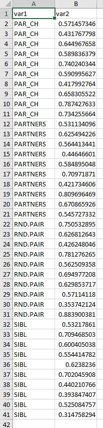
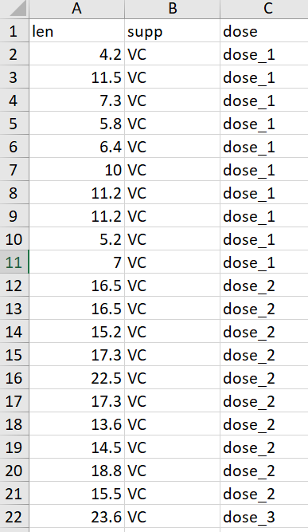

# R语言ggplot2箱线图

这一章主要介绍的是 箱线图 小提琴图 蜂群图 山脊图 这类，因为他们的作用都是一样的，主要就是为了展示数据分布

## 首先是箱线图

最基本的箱线图需要准备两列数据



读取数据

```{r}
library(readxl)
dat01<-read_excel("example_data/05-boxplot/dat01_1.xlsx")
head(dat01)
```

做箱线图使用到的函数是`geom_boxplot()`

最基本的箱线图的代码
```{r}
library(readxl)
dat01<-read_excel("example_data/05-boxplot/dat01_1.xlsx")
head(dat01)
library(ggplot2)
ggplot(data=dat01,aes(x=var1,y=var2))+
  geom_boxplot()
```

箱线图比较常修改的参数是
- color 边框颜色
- fill 填充颜色
- width 箱子整体的宽度

如果要修改成统一的颜色，就把参数写到aes()的外面，参数值是真实的颜色

```{r}
library(readxl)
dat01<-read_excel("example_data/05-boxplot/dat01_1.xlsx")
head(dat01)
library(ggplot2)
ggplot(data=dat01,aes(x=var1,y=var2))+
  geom_boxplot(color="red",
               fill="blue",
               width=0.2)
```

如果要根据不同的变量赋予不同的颜色，就把参数写到aes()的里面，参数值是数据的列名

```{r}
library(readxl)
dat01<-read_excel("example_data/05-boxplot/dat01_1.xlsx")
head(dat01)
library(ggplot2)
ggplot(data=dat01,aes(x=var1,y=var2))+
  geom_boxplot(aes(fill=var1))
```

箱线图还有一个比较常用的操作是添加顶部和底部的小短线，这个geom_boxplot()函数里好像没有专门的参数设置，需要我们借助误差线函数geom_errorbar()来添加,这里展示的不是真实误差，而是数据集的最大值和最小值

这里需要先生成一个新的数据集，每个变量的最小值和最大值

```{r}
library(readxl)
dat01<-read_excel("example_data/05-boxplot/dat01_1.xlsx")
head(dat01)
library(tidyverse)
dat01 %>% 
  group_by(var1) %>% 
  summarise(max_value=max(var2),
            min_value=min(var2)) -> dat01.1
dat01.1
```

用这个新的数据集添加小短线

```{r}
library(readxl)
dat01<-read_excel("example_data/05-boxplot/dat01_1.xlsx")
head(dat01)
library(tidyverse)
dat01 %>% 
  group_by(var1) %>% 
  summarise(max_value=max(var2),
            min_value=min(var2)) -> dat01.1
dat01.1
library(ggplot2)
ggplot()+
  geom_boxplot(data=dat01,aes(x=var1,y=var2,fill=var1))+
  geom_errorbar(data=dat01.1,
                aes(x=var1,
                    ymin=min_value,
                    ymax=max_value))

ggplot()+
  geom_errorbar(data=dat01.1,
                aes(x=var1,
                    ymin=min_value,
                    ymax=max_value))+
  geom_boxplot(data=dat01,aes(x=var1,y=var2,fill=var1))
```
这里有一个知识点是每一个作图函数都可以用不同的数据集，如果要在同一个图上用不同的数据集的话，尽量把数据集接到作图函数里，不写到ggplot()函数里

ggplot2作图是不同函数依次叠加，所以排在后面的函数生成的图形会把前面的覆盖掉，如果觉得有影响 调换一下函数的顺序就可以

误差线函数对应的可以修改的参数比较常用的就是
- width 宽度
- color 颜色
- lty 线型

```{r}
library(readxl)
dat01<-read_excel("example_data/05-boxplot/dat01_1.xlsx")
head(dat01)
library(tidyverse)
dat01 %>% 
  group_by(var1) %>% 
  summarise(max_value=max(var2),
            min_value=min(var2)) -> dat01.1
dat01.1
library(ggplot2)

ggplot()+
  geom_errorbar(data=dat01.1,
                aes(x=var1,
                    ymin=min_value,
                    ymax=max_value),
               color="red",width=0.3,lty="dashed")+
  geom_boxplot(data=dat01,aes(x=var1,y=var2,fill=var1))
```

箱线图有时候还会添加统计检验的显著性等信息，额外的注释信息都可以借助annotate()函数实现，这里的一个小知识点是离散变量的x轴第一个位置是x=1

annotate() 函数比较常用的是添加文本和线段

添加文本需要用到的参数是 
- geom = "text"
- x，y的坐标
- label 文本的内容

```{r}
library(readxl)
dat01<-read_excel("example_data/05-boxplot/dat01_1.xlsx")
head(dat01)
library(tidyverse)
dat01 %>% 
  group_by(var1) %>% 
  summarise(max_value=max(var2),
            min_value=min(var2)) -> dat01.1
dat01.1
library(ggplot2)

ggplot()+
  geom_errorbar(data=dat01.1,
                aes(x=var1,
                    ymin=min_value,
                    ymax=max_value),
               color="red",width=0.3,lty="dashed")+
  geom_boxplot(data=dat01,aes(x=var1,y=var2,fill=var1))+
  annotate(geom="text",x=1.5,y=0.85,
           label="Pvalue = 0.01",color="blue",
           fontface="italic")
```

添加线段需要用到的参数是 
- geom = "segment"
- 线段起始位置的x，y坐标和线段终止位置的x，y坐标

```{r}
library(readxl)
dat01<-read_excel("example_data/05-boxplot/dat01_1.xlsx")
head(dat01)
library(tidyverse)
dat01 %>% 
  group_by(var1) %>% 
  summarise(max_value=max(var2),
            min_value=min(var2)) -> dat01.1
dat01.1
library(ggplot2)

ggplot()+
  geom_errorbar(data=dat01.1,
                aes(x=var1,
                    ymin=min_value,
                    ymax=max_value),
               color="red",width=0.3,lty="dashed")+
  geom_boxplot(data=dat01,aes(x=var1,y=var2,fill=var1))+
  annotate(geom="text",x=1.5,y=0.85,
           label="Pvalue = 0.01",color="blue",
           fontface="italic")+
  annotate(geom = "segment",
           x = 1,y = 0.8,
           xend = 1,yend = 0.82,
           size=1)
```
annotate()函数添加相对比较繁琐，但可定制性比较强

再来添加两条线段

```{r}
library(readxl)
dat01<-read_excel("example_data/05-boxplot/dat01_1.xlsx")
head(dat01)
library(tidyverse)
dat01 %>% 
  group_by(var1) %>% 
  summarise(max_value=max(var2),
            min_value=min(var2)) -> dat01.1
dat01.1
library(ggplot2)

ggplot()+
  geom_errorbar(data=dat01.1,
                aes(x=var1,
                    ymin=min_value,
                    ymax=max_value),
               color="red",width=0.3,lty="dashed")+
  geom_boxplot(data=dat01,aes(x=var1,y=var2,fill=var1))+
  annotate(geom="text",x=1.5,y=0.85,
           label="Pvalue = 0.01",color="blue",
           fontface="italic")+
  annotate(geom = "segment",
           x = 1,y = 0.8,
           xend = 1,yend = 0.82,
           size=1)+
  annotate(geom = "segment",
           x = 1,y = 0.82,
           xend = 2,yend = 0.82,
           size=1)+
  annotate(geom = "segment",
           x = 2,y = 0.82,
           xend = 2,yend = 0.815,
           size=1)
```
如果还想在不同的位置添加文本和线段，可以按照上述思路来设置

## 接下来是带有分组的箱线图

部分示例数据集如下


最基本的分组箱线图

```{r}
library(readxl)
dat02<-read_excel("example_data/05-boxplot/dat02.xlsx")
library(ggplot2)
ggplot(data=dat02,aes(x=dose,y=len,fill=supp))+
  geom_boxplot()
```

分组箱线图添加误差线,还是需要先生成一个新的数据集


```{r}
library(readxl)
dat02<-read_excel("example_data/05-boxplot/dat02.xlsx")
library(tidyverse)
dat02 %>% 
  group_by(dose,supp) %>% 
  summarise(min_value=min(len),
            max_value=max(len)) -> dat02.1
dat02.1
```

用算好的数据添加误差线

```{r}
library(readxl)
dat02<-read_excel("example_data/05-boxplot/dat02.xlsx")
library(tidyverse)
dat02 %>% 
  group_by(dose,supp) %>% 
  summarise(min_value=min(len),
            max_value=max(len)) -> dat02.1
dat02.1
library(ggplot2)
ggplot()+
  geom_errorbar(data=dat02.1,
                aes(x=dose,
                    ymin=min_value,
                    ymax=max_value),
                position = position_dodge(0.9),
                width=0.2)+
  geom_boxplot(data=dat02,aes(x=dose,y=len,fill=supp),
               position = position_dodge(0.9))
```

这种方式好像搞不定，这里我暂时想不到解决办法了，用另外一种方式吧

```{r}
library(readxl)
dat02<-read_excel("example_data/05-boxplot/dat02.xlsx")
library(tidyverse)

library(ggplot2)
ggplot(data=dat02,aes(x=dose,y=len,fill=supp))+
    stat_boxplot(geom = "errorbar",
               width=0.3,
               position = position_dodge(0.9))+
  geom_boxplot(position = position_dodge(0.9))
```

之前的作图函数介绍的都是geom_ 系列的函数，这里用到了stat_系列的函数 这个戏里的函数功能很强大，但是我平时用的不多，具体用法我也不太熟，这里就不过多介绍了

接下来是分组箱线图添加额外的注释信息，这个和上面介绍的普通柱形图是一样的

```{r}
library(readxl)
dat02<-read_excel("example_data/05-boxplot/dat02.xlsx")
library(tidyverse)

library(ggplot2)
ggplot(data=dat02,aes(x=dose,y=len,fill=supp))+
    stat_boxplot(geom = "errorbar",
               width=0.3,
               position = position_dodge(0.9))+
  geom_boxplot(position = position_dodge(0.9))+
  annotate(geom="text",x=1,y=25,
           label="Pvalue = 0.01",color="blue",
           fontface="italic")+
  annotate(geom = "segment",
           x = 0.6,y = 23,
           xend = 0.6,yend = 24,
           size=1)+
  annotate(geom = "segment",
           x = 0.6,y = 24,
           xend = 1.4,yend = 24,
           size=1)+
  annotate(geom = "segment",
           x = 1.4,y = 24,
           xend = 1.4,yend = 12,
           size=1)
```

## 接下来是小提琴图

小提琴图整体和箱线图的作图代码是一样 的，只需要我们把作图函数换成geom_violin()

用箱线图的数据来做演示

```{r}
library(readxl)
dat01<-read_excel("example_data/05-boxplot/dat01_1.xlsx")
head(dat01)
library(ggplot2)
ggplot(data=dat01,aes(x=var1,y=var2))+
  geom_violin()
```

同样的可以更改边框 和填充颜色，如果四同意修改，就把参数写到aes()的外面，用真实颜色值，如果是根据不同的变量赋予不同的颜色就写到aes()的里面，用数据集的列名作为参数的值

```{r}
library(readxl)
dat01<-read_excel("example_data/05-boxplot/dat01_1.xlsx")
head(dat01)
library(ggplot2)
ggplot(data=dat01,aes(x=var1,y=var2))+
  geom_violin(color="black",fill="grey")

ggplot(data=dat01,aes(x=var1,y=var2))+
  geom_violin(aes(fill=var1))
```

分组的小提琴图和箱线图的思路也是一样的

把上面分组箱线图的代码复制过来，把作图函数改成geom_violin()

```{r}
library(readxl)
dat02<-read_excel("example_data/05-boxplot/dat02.xlsx")
library(ggplot2)
ggplot(data=dat02,aes(x=dose,y=len,fill=supp))+
  geom_violin()
```

如果要添加注释信息还是使用annotate()函数

还有一个比较常用的可视化方式是箱线图和小提琴图叠加到一起

```{r}
library(readxl)
dat02<-read_excel("example_data/05-boxplot/dat02.xlsx")
library(tidyverse)

library(ggplot2)
ggplot(data=dat02,aes(x=dose,y=len,fill=supp))+
  geom_violin()+
    stat_boxplot(geom = "errorbar",
               width=0.3,
               position = position_dodge(0.9))+
  geom_boxplot(position = position_dodge(0.9),
               width=0.2)
```

## 类似于箱线图还有小提琴图的还有 

- 抖动的散点图 geom_jitter()

- 蜂群图 需要借助额外的R包ggbeeswarm
https://github.com/eclarke/ggbeeswarm

- 山脊图 借助额外的R包 ggridges
https://cran.r-project.org/web/packages/ggridges/vignettes/introduction.html


geom_jitter

```{r}
library(readxl)
dat01<-read_excel("example_data/05-boxplot/dat01_1.xlsx")
head(dat01)
library(ggplot2)
ggplot(data=dat01,aes(x=var1,y=var2))+
  geom_jitter()

ggplot(data=dat01,aes(x=var1,y=var2))+
  geom_jitter(width=0.2,aes(color=var1))
```

蜂群图
```{r}

library(readxl)
dat01<-read_excel("example_data/05-boxplot/dat01_1.xlsx")
head(dat01)
library(ggplot2)
library(ggbeeswarm)
ggplot(data=dat01,aes(x=var1,y=var2))+
  geom_quasirandom()
```

这个点比较少可能看不出差别，我们用ggbeeswarm这个包帮助文档提供的例子看下

```{r}
set.seed(12345)
library(ggplot2)
library(ggbeeswarm)
#compare to jitter
ggplot(iris,aes(Species, Sepal.Length)) + geom_jitter(color="red")

ggplot(iris,aes(Species, Sepal.Length)) + geom_quasirandom(color="blue")
```

山脊图,这里直接用ggridges这个R包的帮助文档的例子

```{r}
library(ggplot2)
library(ggridges)
ggplot(lincoln_weather, aes(x = `Mean Temperature [F]`, y = Month, fill = stat(x))) +
  geom_density_ridges_gradient(scale = 3, rel_min_height = 0.01) +
  scale_fill_viridis_c(name = "Temp. [F]", option = "C") +
  labs(title = 'Temperatures in Lincoln NE in 2016')
```

最后是今天的实际例子，这个例子的代码来源于一篇Nature的论文

> Environmental factors shaping the gut microbiome in a Dutch population

```{r}
dfToPlot<-read.csv("example_data/05-boxplot/dfToPlot.csv")
head(dfToPlot)
table(dfToPlot$RELATIONSHIP.0)
dfToPlot$RELATIONSHIP.0 <- factor(dfToPlot$RELATIONSHIP.0,
                                  levels=c("RND.PAIR","PARTNERS","PAR_CH","SIBL"))
cbPalette <- c("#E69F00", "#CC79A7", "#56B4E9", "#009E73", "#CC79A7", "#F0E442", "#999999","#0072B2","#D55E00")
ggplot(data=dfToPlot,aes(x=RELATIONSHIP.0,
                         y=BC_Spec,
                         color=RELATIONSHIP.0))+
  geom_jitter(alpha=0.2,
              position=position_jitterdodge(jitter.width = 0.35, 
                                            jitter.height = 0, 
                                            dodge.width = 0.8))+
  geom_boxplot(alpha=0.2,width=0.45,
               position=position_dodge(width=0.8),
               size=0.75,outlier.colour = NA)+
  geom_violin(alpha=0.2,width=0.9,
              position=position_dodge(width=0.8),
              size=0.75)+
  scale_color_manual(values = cbPalette)+
  theme_classic() +
  theme(legend.position="none") + 
  theme(text = element_text(size=16)) + 
  #ylim(0.0,1.3)+
  ylab("Bray-Curtis distance of Species")+
  #scale_x_discrete(labels=c("A","B","C","D"))+
  annotate("segment", x = 1-0.01, y = 1, xend = 2.01,lineend = "round", 
           yend = 1,size=1,colour="black",arrow = arrow(length = unit(0.02, "npc")))+
  annotate("segment", x = 2.01, y = 1, xend = 0.99,lineend = "round", 
           yend = 1,size=1,colour="black",arrow = arrow(length = unit(0.02, "npc")))+
  annotate("text", x=1.5,y=1.01, 
           label=expression("**"~"FDR"~2.41%*%10^-10),vjust=0) -> p4
p4
```