# R语言ggplot2折线图

这一章主要介绍R语言ggplot2画线的函数，我能想到的有

- geom_line()

- geom_path()

- geom_vline()

- geom_hline()

- geom_abline()

- geom_curve()

- geom_segment()

- geom_area() 面积图也可以看成是折线图的一种吧

- geom_ribbon()

## 最基本的折线图

准备数据 一列x和一列y,这里根据x是离散型数据还是连续型数据分为两种情况，

当x是连续型数据的时候

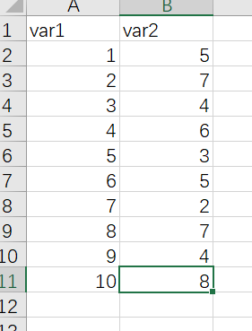

作图代码

```{r}
library(readxl)
library(ggplot2)

dat01<-read_excel("example_data/06-lineplot/dat01.xlsx")

ggplot(data=dat01,aes(x=var1,y=var2))+
  geom_line()
```

线可以修改参数通常有

- 颜色 color

- 粗细 size

- 线型 lty 线型的种类可以参考这个链接 http://www.sthda.com/english/wiki/ggplot2-line-types-how-to-change-line-types-of-a-graph-in-r-software

比如

```{r}
library(readxl)
library(ggplot2)

dat01<-read_excel("example_data/06-lineplot/dat01.xlsx")

ggplot(data=dat01,aes(x=var1,y=var2))+
  geom_line(color="red",size=5,lty="dashed")
```

这里我们看到x轴的刻度不是按照1到10这样截断的，如果要修改的话需要用到scale_x_continues()函数

```{r}
library(readxl)
library(ggplot2)

dat01<-read_excel("example_data/06-lineplot/dat01.xlsx")

ggplot(data=dat01,aes(x=var1,y=var2))+
  geom_line(color="red",size=5,lty="dashed")+
  scale_x_continuous(breaks = 1:10)
```

如果想要把散点也加上的话可以继续叠加geom_point()函数

```{r}

library(readxl)
library(ggplot2)

dat01<-read_excel("example_data/06-lineplot/dat01.xlsx")

ggplot(data=dat01,aes(x=var1,y=var2))+
  geom_line()+
  geom_point()
```

折线图还有一个比较常用的操作是添加误差线，添加误差线的函数是geom_errorbar(),假设我们已经提前算好数据整理到excel里,整理的数据如下

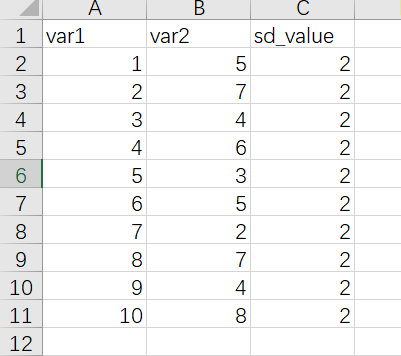

作图代码

```{r}
library(readxl)
library(ggplot2)

dat01<-read_excel("example_data/06-lineplot/dat02.xlsx")

ggplot(data=dat01,aes(x=var1,y=var2))+
  geom_line()+
  geom_point()+
  geom_errorbar(aes(ymin=var2-sd_value,
                    ymax=var2+sd_value),
                width=0.2)
```

有时候可能还需要添加置信区间，添加置信区间的用geom_ribbon()函数，还是提前算好置信区间，数据集整理格式如下

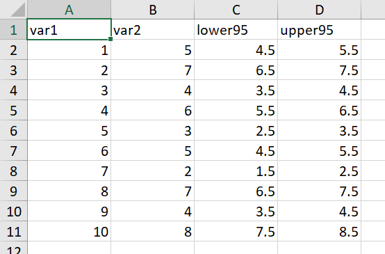

```{r}
library(readxl)
library(ggplot2)

dat01<-read_excel("example_data/06-lineplot/dat02_1.xlsx")

ggplot(data=dat01,aes(x=var1,y=var2))+
  geom_line()+
  geom_point()+
  geom_ribbon(aes(x=var1,ymin=lower95,ymax=upper95),
              fill="red",alpha=0.2)
```

以上是x轴是连续型数据的情况，接下来介绍x轴是离散型数据的情况

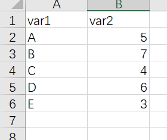

```{r}
library(readxl)
library(ggplot2)

dat01<-read_excel("example_data/06-lineplot/dat03.xlsx")

ggplot(data=dat01,aes(x=var1,y=var2))+
  geom_line()+
  geom_point()
```

以上代码画不出来线，离散型数据还需要我们指定一个group=1参数

```{r}
library(readxl)
library(ggplot2)

dat01<-read_excel("example_data/06-lineplot/dat03.xlsx")

ggplot(data=dat01,aes(x=var1,y=var2,group=1))+
  geom_line()+
  geom_point()
```

离散型数据比较常用的一个操作就是改变x轴的顺序，默认是按照首字母排序，如果想要按照我们自己要求的顺序来，我们给数据赋予因子水平

```{r}
library(readxl)
library(ggplot2)

dat01<-read_excel("example_data/06-lineplot/dat03.xlsx")

dat01$var1<-factor(dat01$var1,
                   levels = c("B","D","C","A","E"))

ggplot(data=dat01,aes(x=var1,y=var2,group=1))+
  geom_line()+
  geom_point()
```

这里需要注意的是赋予因子水平的时候levels参数后面跟的内容必须和数据里的字符完全一致，要不然会出现错误

以上的折线图在拐弯处都是很尖锐的，如果想要用平滑的线用ggplot2里的函数如何实现我暂时想不明白了，这里可以借助其他R包 ggbump 参考链接 https://github.com/davidsjoberg/ggbump 有时间可以自己研究一下，这里暂时不做介绍

## 分组的折线图

分组折线图需要在 x 和 y两列数据的基础上再增加一列表示分组，示例数据如下

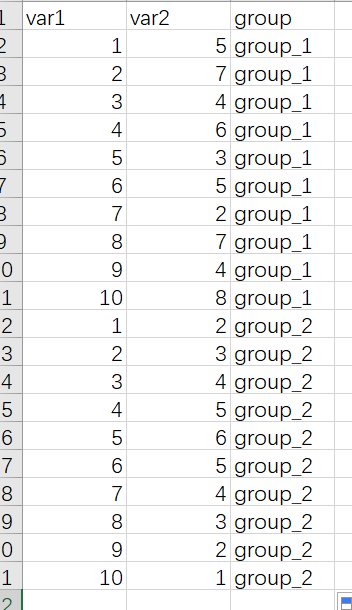


作图代码

```{r}
library(readxl)
library(ggplot2)

dat01<-read_excel("example_data/06-lineplot/dat04.xlsx")

ggplot(data=dat01,aes(x=var1,y=var2,group=group))+
  geom_line()+
  geom_point()
```

用颜色 线型来区分不同的分组

```{r}
library(readxl)
library(ggplot2)

dat01<-read_excel("example_data/06-lineplot/dat04.xlsx")

ggplot(data=dat01,aes(x=var1,y=var2,group=group))+
  geom_line(aes(color=group,lty=group))+
  geom_point(aes(color=group,shape=group))
```

分组数据添加误差线,再给数据集增加一列误差线数据

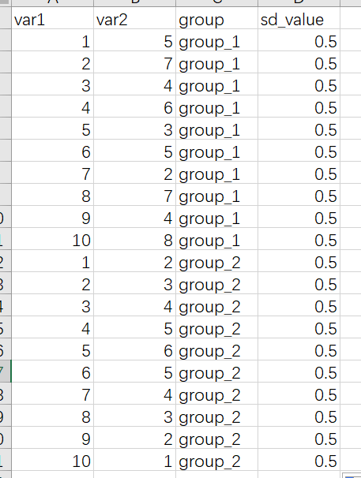

```{r}
library(readxl)
library(ggplot2)

dat01<-read_excel("example_data/06-lineplot/dat04_1.xlsx")

ggplot(data=dat01,aes(x=var1,y=var2,group=group))+
  geom_line(aes(color=group,lty=group))+
  geom_point(aes(color=group,shape=group))+
  geom_errorbar(aes(ymin=var2-sd_value,
                    ymax=var2+sd_value,
                    color=group),
                width=0.2)
```

分组添加置信区间

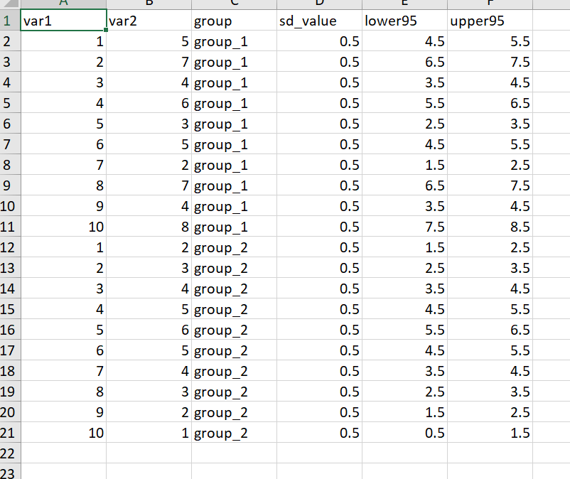

```{r}
library(readxl)
library(ggplot2)

dat01<-read_excel("example_data/06-lineplot/dat04_2.xlsx")

ggplot(data=dat01,aes(x=var1,y=var2,group=group))+
  geom_line(aes(color=group,lty=group))+
  geom_point(aes(color=group,shape=group))+
  geom_ribbon(aes(x=var1,ymin=lower95,ymax=upper95,
                  color=group),alpha=0.2)
```

接下来是自定义这些 颜色 形状 等

```{r}
library(readxl)
library(ggplot2)

dat01<-read_excel("example_data/06-lineplot/dat04_2.xlsx")

ggplot(data=dat01,aes(x=var1,y=var2,group=group))+
  geom_line(aes(color=group,lty=group))+
  geom_point(aes(color=group,shape=group))+
  geom_ribbon(aes(x=var1,ymin=lower95,ymax=upper95,
                  color=group),alpha=0.2)+
  scale_color_manual(values = c("group_1"="blue","group_2"="darkgreen"))
```

x轴是离散数据的分组折线图,基本上和连续型的数据是一样的

示例数据集如下

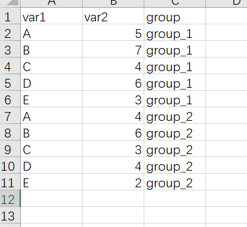

```{r}
library(readxl)
library(ggplot2)

dat01<-read_excel("example_data/06-lineplot/dat05.xlsx")

ggplot(data=dat01,aes(x=var1,y=var2,group=group))+
  geom_line(aes(color=group,lty=group))
```

折线图x轴是时间型数据，比如如下示例

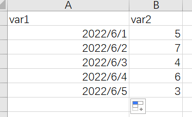

这种情况我个人建议是给数据集增加一列连续型的数据用来做x，然后再修改x轴的坐标轴标签，比如把数据集改成如下

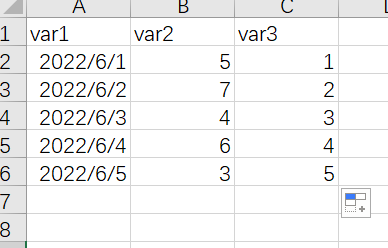

作图代码

```{r}
library(readxl)
library(ggplot2)

dat01<-read_excel("example_data/06-lineplot/dat06.xlsx",
                  sheet = "Sheet2")

ggplot(data=dat01,aes(x=var3,y=var2))+
  geom_line()+
  scale_x_continuous(breaks = 1:5,
                     labels = dat01$var1)
```

以上内容作图都是用到的geom_line()函数，接下来介绍geom_path()函数 参考 https://ggplot2.tidyverse.org/reference/geom_path.html

```{r}
library(readxl)
library(ggplot2)

dat01<-read_excel("example_data/06-lineplot/dat07.xlsx")

ggplot(data=dat01,aes(x=var1,y=var2))+
  geom_line()+
  geom_point()

ggplot(data=dat01,aes(x=var1,y=var2))+
  geom_path()+
  geom_point()
```

从上图我们可以看出来geom_line()函数是按照x数值的大小从前往后连，geom_path()函数是按照数据集出现的顺序连

## 添加线段

添加线段用到的函数是

- geom_segment() 直线

- geom_curve() 曲线

比如一个简单的数据集

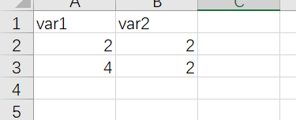

```{r}
library(readxl)
library(ggplot2)

dat01<-read_excel("example_data/06-lineplot/dat08.xlsx")

ggplot(data=dat01,aes(x=var1,y=var2))+
  geom_point(size=5)
```

在以上两个点之间添加一个线段

```{r}
library(readxl)
library(ggplot2)

dat01<-read_excel("example_data/06-lineplot/dat08.xlsx")

ggplot(data=dat01,aes(x=var1,y=var2))+
  geom_point(size=5)+
  geom_segment(aes(x=2,xend=4,y=2,yend=2))
```
如果是曲线

```{r}
library(readxl)
library(ggplot2)

dat01<-read_excel("example_data/06-lineplot/dat08.xlsx")

ggplot(data=dat01,aes(x=var1,y=var2))+
  geom_point(size=5)+
  geom_curve(aes(x=2,xend=4,y=2,yend=2))
```

曲线可以调节弧度,用到 curvature 参数

```{r}
library(readxl)
library(ggplot2)

dat01<-read_excel("example_data/06-lineplot/dat08.xlsx")

ggplot(data=dat01,aes(x=var1,y=var2))+
  geom_point(size=5)+
  geom_curve(aes(x=2,xend=4,y=2,yend=2),curvature = 0.2)

ggplot(data=dat01,aes(x=var1,y=var2))+
  geom_point(size=5)+
  geom_curve(aes(x=2,xend=4,y=2,yend=2),curvature = -1)
```

添加箭头的话也是用到这两个函数

```{r}
library(readxl)
library(ggplot2)

dat01<-read_excel("example_data/06-lineplot/dat08.xlsx")

ggplot(data=dat01,aes(x=var1,y=var2))+
  geom_point(size=5)+
  geom_segment(aes(x=2,xend=4,y=2,yend=2),
               arrow = arrow())
ggplot(data=dat01,aes(x=var1,y=var2))+
  geom_point(size=5)+
  geom_curve(aes(x=2,xend=4,y=2,yend=2),curvature = 0.2,
             arrow = arrow())
```

## 添加辅助线

https://ggplot2.tidyverse.org/reference/geom_abline.html

- 垂直辅助线 geom_vline() 只需要指定xintercept

- 水平辅助线 geom_hline() 只需要指定yintercept

- 带有角度的线段 geom_abline() 需要指定截距 intercept 和斜率 slope

接下来用鸢尾花的数据集做一个演示

```{r}
library(ggplot2)

head(iris)

ggplot(data=iris,aes(x=Sepal.Length,y=Sepal.Width))+
  geom_point()+
  geom_vline(xintercept = 6,size=1,lty="solid",color="red")

ggplot(data=iris,aes(x=Sepal.Length,y=Sepal.Width))+
  geom_point()+
  geom_hline(yintercept = 3,size=1,lty="solid",color="red")

ggplot(data=iris,aes(x=Sepal.Length,
                     y=Sepal.Width))+
  geom_point()+
  geom_abline(intercept = 4,
              slope =-0.2 ,
              size=1,
              lty="solid",color="red")
```

## 面积图

用最基本的折线图数据做一个演示

```{r}
library(readxl)
library(ggplot2)

dat01<-read_excel("example_data/06-lineplot/dat01.xlsx")

ggplot(data=dat01,aes(x=var1,y=var2))+
  geom_area()

ggplot(data=dat01,aes(x=var1,y=var2))+
  geom_area(fill="red",color="blue",alpha=0.2)
```

## 实际例子

```{r}
library(pacman)
p_load(tidyverse, showtext, ggtext)

#eurovision_raw <- readr::read_csv('https://raw.githubusercontent.com/rfordatascience/tidytuesday/master/data/2022/2022-05-17/eurovision.csv')

#readr::write_csv(eurovision_raw,file = "eurovision_raw.csv")

eurovision_raw <- readr::read_csv("example_data/06-lineplot/eurovision_raw.csv")

eurovision <- eurovision_raw %>% 
  filter(year >= 2005, section == "grand-final") # This is the first year where the 'grand-final' happens

# Analysis ----------------------------------------------------------------
highest_scores_by_rank <- eurovision %>% 
  filter(rank <= 3) %>% 
  group_by(rank) %>% 
  slice_max(total_points, n = 1) %>% 
  ungroup() %>% 
  select(year, artist_country, total_points)

# Margin between 1st and 2nd
eurovision %>% 
  select(rank, total_points, year) %>% 
  filter(rank <= 2) %>% 
  group_by(year) %>% 
  arrange(rank) %>% 
  mutate(margin = total_points - lag(total_points)) %>% 
  ungroup() %>% 
  filter(rank == 2) %>% 
  slice_min(margin, n = 1)

eurovision %>% 
  mutate(rank = factor(rank)) %>% 
  ggplot(aes(year, total_points, group = rank, color = rank)) +
  geom_line(data = eurovision %>% filter(rank > 3), color = "grey75", size = .25, alpha = .5) +
  geom_line(data = eurovision %>% filter(rank == 3), color = "#0FB5AE", size = .75) +
  geom_line(data = eurovision %>% filter(rank == 2), color = "#4046CA", size = .75) +
  geom_line(data = eurovision %>% filter(rank == 1), color = "#F68511", size = .75) +
  geom_point(data = eurovision %>% filter(year == 2017, rank == 1), 
             shape = 21, color = "white", fill = "#F68511" , size = 1.5) +
  geom_point(data = eurovision %>% filter(year == 2009, rank == 1), 
             shape = 21, color = "white", fill = "#F68511" , size = 1.5) +
  geom_point(data = eurovision %>% filter(year == 2009, rank == 2), 
             shape = 21, color = "white", fill = "#4046CA" , size = 1.5) +
  annotate(geom = "segment", x = 2009, xend = 2009, 
           y = 218 + 169, yend = 218, size = .1, color = "black") +
  annotate("text", x = 2017, y = highest_scores_by_rank$total_points[1] + 30, 
           label = highest_scores_by_rank$total_points[1], hjust = .5,
           color = "#F68511", family = "serif", fontface = "bold", size = 6) +
  annotate("text", x = 2009.1, y = 218 + 169 + 30, label = 218 + 169, 
           hjust = 0, color = "#F68511", family = "serif", fontface = "bold", size = 6) +
  annotate("text", x = 2009.1, y = 218 + 30, label = 218, hjust = 0, color = "#4046CA", 
           family = "serif", fontface = "bold", size = 6) +
  coord_cartesian(expand = c(0, 0),
                  ylim = c(0, 800)) +
  theme_minimal(base_family = "serif") +
  labs(x = NULL,
       y = "Total points",
       title = "EUROVISION points are trending upwards",
       subtitle = "The upward gradual trend reflects that countries need more points to come <span style='color:#F68511'>**first**</span>, <span style='color:#4046CA'>**second**</span>, and <span style='color:#0FB5AE'>**third**</span><br>with each new edition",
       caption = "Visualization by Pablo Alvarez | Data from Eurovision"
  ) +
  theme(
    plot.margin = margin(rep(10, 4)),
    panel.grid = element_blank(),
    panel.grid.major = element_line(size = .15, color = "grey75"),
    plot.background = element_rect(fill = "grey90", color = "grey90"),
    panel.background = element_rect(fill = "grey90", color = "grey90"),
    axis.title.y = element_text(angle = 90, hjust = .99, size = 16.5, color = "grey25"),
    axis.title.x = element_text(hjust = 0, size = 20, color = "grey15"),
    axis.text = element_text(size = 16, color = "grey50"), 
    axis.line = element_line(color = "grey75", size = .15),
    plot.title = element_text(size = 32,
                              color = "black",
                              family = "serif",
                              hjust = 0),
    plot.subtitle = element_markdown(size = 16,
                                     color = "black",
                                     family = "serif",
                                     hjust = 0,
                                     margin = margin(b = 20, t = 1),
                                     lineheight = .35),
    plot.caption = element_text(size = 18,
                                color = "grey50",
                                hjust = 0,
                                margin = margin(t = 20),
                                lineheight = .3)
  )
```