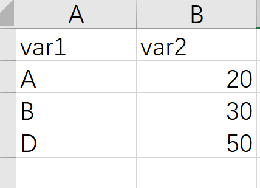
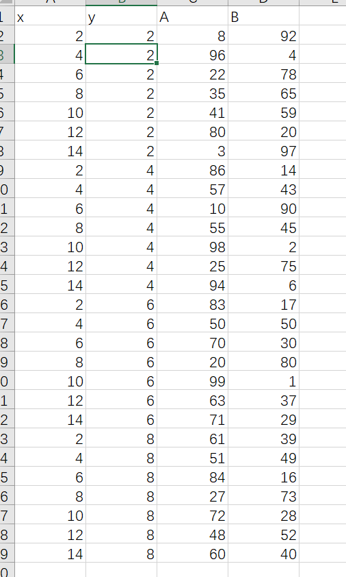

# R语言ggplot2饼状图

饼状图主要用来展示比例，R语言ggplot2包好像没有专门画饼状图的函数，ggplot2的实现方式是先画堆积柱形图，然后再极坐标的形式转换成饼图，这里极坐标具体的含义我也不懂，这里先记住这个名词

## 最基本的饼状图

最基本的数据格式如下 



第一列是变量的名字，第二列是变量的数值，这里数值可以先不用转换成比例

作图代码

参考链接 http://www.sthda.com/english/wiki/ggplot2-pie-chart-quick-start-guide-r-software-and-data-visualization

堆积柱形图代码

```{r}
library(readxl)
dat01<-read_excel("example_data/07-pieplot/dat01.xlsx")
library(ggplot2)
ggplot(data=dat01,aes(x=1,y=var2,fill=var1))+
  geom_bar(stat="identity",position = "stack",width=1)
```

加上极坐标转换成饼状图

```{r}
library(readxl)
dat01<-read_excel("example_data/07-pieplot/dat01.xlsx")
library(ggplot2)
ggplot(data=dat01,aes(x=1,y=var2,fill=var1))+
  geom_bar(stat="identity",position = "stack",width=1)+
  coord_polar("y", start=0)

ggplot(data=dat01,aes(x=1,y=var2,fill=var1))+
  geom_bar(stat="identity",position = "stack",width=1)+
  coord_polar("y", start=20)
```

start参数可以让饼状图顺时针或者逆时针旋转

饼状图最常用的一个操作是在给个部分添加上文字展示真实的比例值，这里我们使用annotate()函数,这个比例值需要自己先算一下

这里需要注意的一个地方是坐标，原来的坐标跟极坐标之间是如何转化的我还没有搞明白，我的做法是先随便指定一个位置，然后根据这个文本在图中出现的位置然后调试

```{r}
library(readxl)
dat01<-read_excel("example_data/07-pieplot/dat01.xlsx")
library(ggplot2)
ggplot(data=dat01,aes(x=1,y=var2,fill=var1))+
  geom_bar(stat="identity",position = "stack",width=1)+
  coord_polar("y", start=0)+
  annotate(geom = "text",x=1,y=90,label="20%")


ggplot(data=dat01,aes(x=1,y=var2,fill=var1))+
  geom_bar(stat="identity",position = "stack",width=1)+
  coord_polar("y", start=0)+
  annotate(geom = "text",x=1,y=90,label="20%")+
  annotate(geom = "text",x=1,y=60,label="30%")+
  annotate(geom = "text",x=1,y=20,label="50%")
```


然后是自定义颜色

```{r}
library(readxl)
dat01<-read_excel("example_data/07-pieplot/dat01.xlsx")
library(ggplot2)

ggplot(data=dat01,aes(x=1,y=var2,fill=var1))+
  geom_bar(stat="identity",position = "stack",width=1)+
  coord_polar("y", start=0)+
  annotate(geom = "text",x=1,y=90,label="20%")+
  annotate(geom = "text",x=1,y=60,label="30%")+
  annotate(geom = "text",x=1,y=20,label="50%")+
  scale_fill_manual(values = c("A"="#7f7f7f",
                               "B"="#fe0904",
                               "D"="#f9b54f"))
```

饼状图的文本一种比较方便的处理方式是直接添加到图例的文本位置上

修改图例的文本，可以在自定义颜色的参数里添加上labels参数

```{r}
library(readxl)
dat01<-read_excel("example_data/07-pieplot/dat01.xlsx")
library(ggplot2)

ggplot(data=dat01,aes(x=1,y=var2,fill=var1))+
  geom_bar(stat="identity",position = "stack",width=1)+
  coord_polar("y", start=0)+
  annotate(geom = "text",x=1,y=90,label="20%")+
  annotate(geom = "text",x=1,y=60,label="30%")+
  annotate(geom = "text",x=1,y=20,label="50%")+
  scale_fill_manual(values = c("A"="#7f7f7f",
                               "B"="#fe0904",
                               "D"="#f9b54f"),
                    labels=c("A"= "A (20%)",
                             "B" = "B (30%)",
                             "D" = "D (50%)"))

```

饼状图通常是没有背后的灰色背景之类的，通过设置主题把这些全部去掉

```{r}
library(readxl)
dat01<-read_excel("example_data/07-pieplot/dat01.xlsx")
library(ggplot2)

ggplot(data=dat01,aes(x=1,y=var2,fill=var1))+
  geom_bar(stat="identity",position = "stack",width=1)+
  coord_polar("y", start=0)+
  annotate(geom = "text",x=1,y=90,label="20%")+
  annotate(geom = "text",x=1,y=60,label="30%")+
  annotate(geom = "text",x=1,y=20,label="50%")+
  scale_fill_manual(values = c("A"="#7f7f7f",
                               "B"="#fe0904",
                               "D"="#f9b54f"))+
  theme_void()
```

以上是最基本的饼状图

## 中间空心的饼状图

通过设置x坐标的范围来实现其中的空心效果

```{r}
library(readxl)
dat01<-read_excel("example_data/07-pieplot/dat01.xlsx")
library(ggplot2)

ggplot(data=dat01,aes(x=1,y=var2,fill=var1))+
  geom_bar(stat="identity",position = "stack",width=1)+
  coord_polar("y", start=0)+
  annotate(geom = "text",x=1,y=90,label="20%")+
  annotate(geom = "text",x=1,y=60,label="30%")+
  annotate(geom = "text",x=1,y=20,label="50%")+
  scale_fill_manual(values = c("A"="#7f7f7f",
                               "B"="#fe0904",
                               "D"="#f9b54f"))+
  theme_void()+
  xlim(0,NA)
```


## 其他效果的饼状图

上面极坐标的参数是y,如果把参数改成x


```{r}
library(readxl)
dat01<-read_excel("example_data/07-pieplot/dat01.xlsx")
library(ggplot2)

ggplot(data=dat01,aes(x=var1,y=var2,fill=var1))+
  geom_bar(stat="identity",width=1)+
  coord_polar("x", start=0)+
  annotate(geom = "text",x=1,y=90,label="20%")+
  annotate(geom = "text",x=1,y=60,label="30%")+
  annotate(geom = "text",x=1,y=20,label="50%")+
  scale_fill_manual(values = c("A"="#7f7f7f",
                               "B"="#fe0904",
                               "D"="#f9b54f"))+
  theme_void()
```

普通的柱形图加上极坐标转化的效果

```{r}
library(readxl)
dat01<-read_excel("example_data/07-pieplot/dat01.xlsx")
library(ggplot2)

ggplot(data=dat01,aes(x=var1,y=var2,fill=var1))+
  geom_bar(stat="identity",width=1)+
  coord_polar("y", start=0)+
  annotate(geom = "text",x=1,y=90,label="20%")+
  annotate(geom = "text",x=1,y=60,label="30%")+
  annotate(geom = "text",x=1,y=20,label="50%")+
  scale_fill_manual(values = c("A"="#7f7f7f",
                               "B"="#fe0904",
                               "D"="#f9b54f"))+
  theme_void()
```

以上文本位置都对不上，需要我们单独调节


## 其中某一块可以离开的饼图

这个用ggplot2如何实现我暂时想不到，这里需要借助另外的R包ggforce,大家如果想要这种效果的话可以参考一下这个视频

https://www.bilibili.com/video/BV1Sa411w7cP?spm_id_from=333.999.0.0

这里就不介绍代码了

## 多层嵌套的饼状图

多层嵌套的饼状图和一组的思路是一样的，我们多准备几组数据既可以了

```{r}
library(readxl)
dat01<-read_excel("example_data/07-pieplot/dat01.xlsx")
dat02<-read_excel("example_data/07-pieplot/dat02.xlsx")
library(ggplot2)

ggplot()+
  geom_bar(data=dat01,aes(x=1,y=var2,fill=var1),
           stat="identity",position = "stack",width=0.5)+
  geom_bar(data=dat02,aes(x=2,y=var2,fill=var1),
           stat="identity",position = "stack",width=1)+
  coord_polar("y", start=0)
```

第二组数据里如果没有其中某个变量就会空白出来一部分

```{r}
library(readxl)
dat01<-read_excel("example_data/07-pieplot/dat01.xlsx")
dat03<-read_excel("example_data/07-pieplot/dat03.xlsx")
library(ggplot2)

ggplot()+
  geom_bar(data=dat01,aes(x=1,y=var2,fill=var1),
           stat="identity",position = "stack",width=0.5)+
  geom_bar(data=dat03,aes(x=2,y=var2,fill=var1),
           stat="identity",position = "stack",width=1)+
  coord_polar("y", start=0)
```

叠加三组数据

```{r}
library(readxl)
dat01<-read_excel("example_data/07-pieplot/dat01.xlsx")
dat03<-read_excel("example_data/07-pieplot/dat03.xlsx")
dat04<-read_excel("example_data/07-pieplot/dat04.xlsx")
library(ggplot2)

ggplot()+
  geom_bar(data=dat01,aes(x=1,y=var2,fill=var1),
           stat="identity",position = "stack",width=0.5)+
  geom_bar(data=dat03,aes(x=2,y=var2,fill=var1),
           stat="identity",position = "stack",width=1)+
  geom_bar(data=dat04,aes(x=3,y=var2,fill=var1),
           stat="identity",position = "stack",width=1)+
  coord_polar("y", start=0)
```


## 一次性画很多个饼状图

这个用ggplot2如何实现我暂时也想不到了，这里借助额外的R包scatterpie,这里用之前B站录制过的视频介绍 https://www.bilibili.com/video/BV1nb4y1f75k?spm_id_from=333.999.0.0

示例数据集如下




```{r}
df<-read.csv("example_data/07-pieplot/mutilpie_example.csv",header=T)
df

#install.packages("scatterpie")

library(scatterpie)
library(ggplot2)
ggplot()+
  geom_scatterpie(data=df,
                  aes(x,y,r=0.9),
                  cols = c("A","B"))+
  coord_equal()+
  theme_void()+
  theme(legend.position = "none")+
  scale_fill_manual(values = c("#5b9bd5","#e64b35"))
```

## 饼状图的两个实例

数据代码来源

https://github.com/jack-davison/TidyTuesday/blob/master/R/2021_02_16_dubois.R

```{r}
library(tidyverse)

library(cowplot)

tuesdata_occupation <- readr::read_csv("example_data/07-pieplot/20220530_piechart.csv")
dat = tuesdata_occupation %>%
  janitor::clean_names() %>%
  mutate(plot_perc = percentage / sum(percentage)) %>%
  mutate(plot_perc = (plot_perc * 61)/100) %>%
  bind_rows(tibble(group = c("Negroes", "Whites"),
                   occupation = c("empty", "empty"),
                   percentage = c(0,0),
                   plot_perc = c(0.195, 0.195))) %>%
  mutate(occupation = factor(occupation,
                             levels = c("Agriculture, Fisheries and Mining",
                                        "Domestic and Personal Service",
                                        "Manufacturing and Mechanical Industries",
                                        "Trade and Transportation",
                                        "Professions",
                                        "Empty"))) %>%
  arrange(desc(group), occupation) %>%
  mutate(ypos = cumsum(plot_perc)- 0.5*plot_perc) %>%
  arrange(occupation)


lab_dat = dat %>%
  select(occupation) %>%
  distinct() %>%
  drop_na() %>%
  mutate(x = c(-1.5, 1.5, -1.5, 1.5, 1.5),
         y = c(4, 5, 2, 1, 3),
         occupation = case_when(
           occupation == "Agriculture, Fisheries and Mining" ~ "AGRICULTURE, FISHERIES\nAND MINING.",
           occupation == "Domestic and Personal Service" ~ "DOMESTIC AND\nPERSONAL SERVICE.",
           occupation == "Manufacturing and Mechanical Industries" ~ "MANUFACTURING AND\nMECHANICAL INDUSTRIES.",
           occupation == "Trade and Transportation" ~ "TRADE AND\nTRANSPORTATION.",
           occupation == "Professions" ~ "PROFESSIONS."
         ))
dat

pie = ggplot(dat, aes(y = "", x = plot_perc, 
                      fill = occupation, group = group)) +
  geom_col(aes(color = occupation == "empty")) +
  coord_polar(start = pi - (55*pi)/180) +
  scale_fill_manual(values = c("#b8243c", "#f2c50a", 
                               "#5a6796", "#d5c8b7", "#ab927a"), 
                    na.translate = F) +
  theme_void() +
  theme(legend.position = "none",
        plot.background = element_rect(color = NA, 
                                       fill = "#ece5d5"),
        text = element_text(family = "mono"),
        plot.title = element_text(hjust = .5, face = "bold"), 
        plot.margin = unit(rep(.5,4), "cm")) +
  geom_text(aes(x = ypos, 
                label = ifelse(occupation == "empty", NA, 
                               glue::glue("{round(percentage,1)}%"))),
            nudge_y = .35, family = "mono") +
  annotate(geom = "text", x = 0.65, y = 1.5, 
           label = "NEGROES.", family = "mono") +
  annotate(geom = "text", x = 0.15, y = 1.5, 
           label = "WHITES.", family = "mono") +
  scale_color_manual(values = c("#5f4e3b", NA)) +
  guides(color = guide_none()) +
  labs(title = "OCCUPATIONS OF NEGROES AND WHITES IN GEORGIA.")
pie

legend = ggplot(lab_dat, aes(x,y, fill = occupation)) +
  geom_point(shape = 21, size = 10) +
  geom_text(data = lab_dat %>% filter(x == -1.5),
            aes(label = occupation),
            nudge_x = .55, family = "mono", size = 3) +
  geom_text(data = lab_dat %>% filter(x == 1.5),
            aes(label = occupation),
            nudge_x = -.4, family = "mono", size = 3) +
  scale_fill_manual(values = c("#b8243c", "#f2c50a", 
                               "#5a6796", "#d5c8b7", "#ab927a"), na.translate = F) +
  theme_void() +
  theme(text = element_text(family = "mono"),
        legend.position = "none", aspect.ratio = .3) +
  coord_cartesian(clip = "off")

ggdraw(plot = pie) +
  draw_plot(legend, 
            scale = .7)
```

第二个实例

数据代码来源

https://github.com/etmckinley/Tidy-Tuesday/blob/main/30%20Day%20Chart%20Challenge/2022/1/1-%20passing%20feet.R

```{r}
library(tidyverse)

library(gggibbous)

team_passing<-readr::read_csv("example_data/07-pieplot/20220530_piechart_01.csv")

team_info<-readr::read_csv("example_data/07-pieplot/team_info.csv")
limits=c(0,2)
team_passing %>% 
  filter(Comp == "Premier League") %>% 
  left_join(team_info %>% select(Squad, Primary, Secondary)) %>% 
  #bind_rows(team_passing %>% 
  #            filter(Comp == "Premier League") %>% 
  #            mutate(ratio=1)) %>% 
  ggplot()+
  geom_moon(aes(ratio=ratio, fill=Secondary), x=1, y=1, right=FALSE, size=20)+
  geom_moon(aes(ratio=1-ratio, fill=Primary), x=1, y=1, right=TRUE, size=20)+
  geom_text(aes(label = paste0(format(round((1-ratio)*100,1), nsmall=1), "%")),
            x=1.25, y=1, size=2, family="serif", color="white")+
  coord_cartesian(xlim=limits, ylim=limits)+
  facet_wrap(~reorder(Squad,-ratio),ncol = 8)+
  scale_fill_identity()+
  theme_void()+
  theme(legend.position = "none",
        #text=element_text(size=40, family = "serif"),
        #plot.caption=element_text(size=14),
        #plot.subtitle = element_text(size=18),
        plot.margin = margin(.2,.2,.2,.2, unit="in"))+
  labs(title= "What foot do Premier League teams pass with?",
       subtitle= "2021-2022 Premier League season\n",
       caption= "Plot: @etmckinley | data: StatsBomb via FBRef and {worldfootballr}")

```