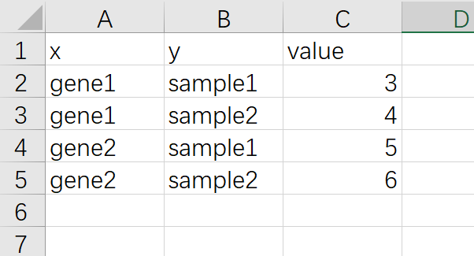
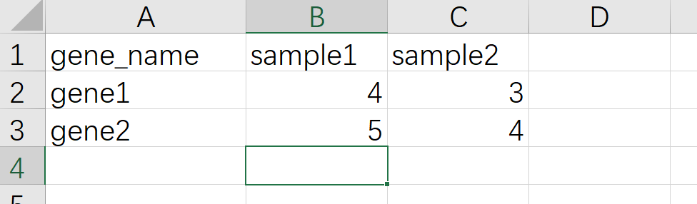
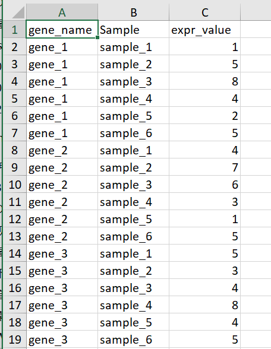
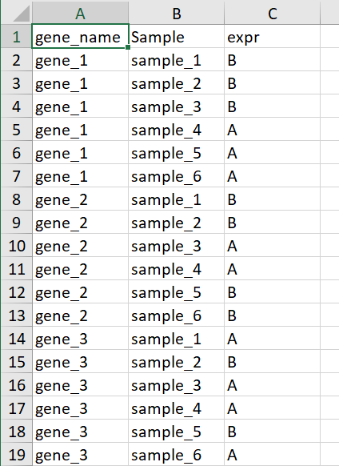

# R语言ggplot2热图

## pheatmap热图

R语言里做热图最快捷的方式是用pheatmap这个R包,优点是用非常少的代码就可以出一个比较好看的图，缺点是细节修改不是很方便，比如要用热图展示基因表达量的数据，准备数据的格式如下


pheatmap不是R语言自带的R包，第一次使用需要先安装,安装直接使用命令`install.packages("pheatmap")`

读取数据

```{r}
library(readxl)
dat01<-read_excel("example_data/06-lineplot/dat08.xlsx")
```

这里需要注意的 一个点是热图数据通常需要把第一列的基因名作为整个数据的行名，但是读取excel的函数好像没有指定列为行名的函数，当然可以将数据集读取进来以后再进行转换，另外一种方式就是把数据另存为csv格式，然后用读取csv格式数据的函数

这里需要注意的一点是转换为csv格式的时候选择如下截图中的2，不要选择1


读取csv格式数据

```{r}
dat01<-read.delim(file = "example_data/08-heatmap/01pheatmap_example.csv",
                  header=TRUE,
                  sep=",",
                  row.names = 1)

```

作图代码

```{r}
dat01<-read.delim(file = "example_data/08-heatmap/01pheatmap_example.csv",
                  header=TRUE,
                  sep=",",
                  row.names = 1)
library(pheatmap)
pheatmap(dat01)
```

如果要在色块上添加文本，再单独准备一个和热图数据格式一样的数据，然后用display_numbers参数添加文本,这里我就直接使用热图的数据

```{r}
dat01<-read.delim(file = "example_data/08-heatmap/01pheatmap_example.csv",
                  header=TRUE,
                  sep=",",
                  row.names = 1)
library(pheatmap)
pheatmap(dat01)
pheatmap(dat01,
         display_numbers = dat01)
```

以上是对pheatmap这个R包的简要介绍

ggplot2也有直接做热图的函数 geom_tile(),ggplot2做热图可能代码稍微繁琐，但是优点是细节调整方便，基本上所有的细节都可以用代码来调整

ggplot2做热图还需要掌握的一个知识点是 长格式数据 和 宽格式 数据，ggplot2作图的输入数据都是长格式数据，长格式数据如下，一列x，一列y，还有一个数据



宽格式数据截图如下




这个长宽格式转化是ggplot2作图必须理解的一个概念

R语言里提供了长宽格式数据互相转化的函数，这里我以tidyverse这个R包里的函数作为介绍，tidyverse主要是用来在数据处理的，也不是R语言自带的R包，需要运行安装命令`install.packages("tidyverse")`

宽格式数据转换为长格式用到的函数是pivot_longer()

转换代码

```{r}
library(readxl)
dat01<-read_excel("example_data/08-heatmap/02_wide_data.xlsx")
head(dat01)
library(tidyverse)

dat01 %>% 
  pivot_longer(-gene_name,names_to = "A",values_to = "B")
```

长格式转换为宽格式的函数是pivot_wider()

转换代码

```{r}
library(readxl)
dat01<-read_excel("example_data/08-heatmap/02_long_data.xlsx")
head(dat01)
library(tidyverse)

dat01 %>% 
  pivot_wider(names_from = y,values_from = value)
```

这个是最基本的长宽格式数据转换，如果数据集有很多列，有时候转换会相对比较复杂，这里就不做介绍，因为我也搞不懂有时候

## ggplot2热图

以下介绍ggplot2做热图的代码都是假设已经拿到了长格式数据

示例数据如下



最基本的热图代码

```{r}
library(readxl)
dat01<-read_excel("example_data/08-heatmap/03_heatmap_example.xlsx")
head(dat01)

library(ggplot2)

ggplot(data=dat01,aes(x=gene_name,y=Sample))+
  geom_tile(aes(fill=expr_value),color="red")

ggplot(data=dat01,aes(x=gene_name,y=Sample))+
  geom_tile(aes(fill=expr_value),color=NA)
```

热图经常遇到的操作是调整坐标轴的顺序，这个可以通过赋予因子水平来实现

```{r}
library(readxl)
dat01<-read_excel("example_data/08-heatmap/03_heatmap_example.xlsx")
head(dat01)

dat01$gene_name<-factor(dat01$gene_name,
                        levels = c("gene_1","gene_2","gene_3",
                                   "gene_4","gene_5","gene_6",
                                   "gene_7","gene_8","gene_9",
                                   "gene_10"))

library(ggplot2)

ggplot(data=dat01,aes(x=gene_name,y=Sample))+
  geom_tile(aes(fill=expr_value),color="red")

dat01$Sample<-factor(dat01$Sample,
                     levels = c("sample_2","sample_4","sample_6",
                                "sample_1","sample_3","sample_5"))

ggplot(data=dat01,aes(x=gene_name,y=Sample))+
  geom_tile(aes(fill=expr_value),color="red")
```

更改热图色块填充的颜色

更改热图填充颜色有很多种方式，这里我介绍我自己最常用的一种方式

参考链接

https://r-charts.com/

这里用到额外的一个R包 paletteer

https://github.com/EmilHvitfeldt/paletteer

```{r}
library(readxl)
dat01<-read_excel("example_data/08-heatmap/03_heatmap_example.xlsx")
head(dat01)

dat01$gene_name<-factor(dat01$gene_name,
                        levels = c("gene_1","gene_2","gene_3",
                                   "gene_4","gene_5","gene_6",
                                   "gene_7","gene_8","gene_9",
                                   "gene_10"))

library(ggplot2)

ggplot(data=dat01,aes(x=gene_name,y=Sample))+
  geom_tile(aes(fill=expr_value),color="red")

library(paletteer)

ggplot(data=dat01,aes(x=gene_name,y=Sample))+
  geom_tile(aes(fill=expr_value),color="red")+
  scale_fill_paletteer_c("ggthemes::Classic Orange-White-Blue")

ggplot(data=dat01,aes(x=gene_name,y=Sample))+
  geom_tile(aes(fill=expr_value),color="red")+
  scale_fill_paletteer_c("ggthemes::Classic Orange-White-Blue",
                         direction = -1)
```

调整坐标轴文本标签的位置，y轴左右，x轴是上下

```{r}
library(readxl)
dat01<-read_excel("example_data/08-heatmap/03_heatmap_example.xlsx")
head(dat01)

dat01$gene_name<-factor(dat01$gene_name,
                        levels = c("gene_1","gene_2","gene_3",
                                   "gene_4","gene_5","gene_6",
                                   "gene_7","gene_8","gene_9",
                                   "gene_10"))

library(ggplot2)

library(paletteer)

ggplot(data=dat01,aes(x=gene_name,y=Sample))+
  geom_tile(aes(fill=expr_value),color="red")+
  scale_fill_paletteer_c("ggthemes::Classic Orange-White-Blue",
                         direction = -1)+
  scale_x_discrete(position = "top")+
  scale_y_discrete(position = "right")
```

调整坐标轴的文本方向

```{r}
library(readxl)
dat01<-read_excel("example_data/08-heatmap/03_heatmap_example.xlsx")
head(dat01)

dat01$gene_name<-factor(dat01$gene_name,
                        levels = c("gene_1","gene_2","gene_3",
                                   "gene_4","gene_5","gene_6",
                                   "gene_7","gene_8","gene_9",
                                   "gene_10"))

library(ggplot2)

library(paletteer)

ggplot(data=dat01,aes(x=gene_name,y=Sample))+
  geom_tile(aes(fill=expr_value),color="red")+
  scale_fill_paletteer_c("ggthemes::Classic Orange-White-Blue",
                         direction = -1)+
  scale_x_discrete(position = "top")+
  scale_y_discrete(position = "right")+
  theme(axis.text.x = element_text(angle=60))

ggplot(data=dat01,aes(x=gene_name,y=Sample))+
  geom_tile(aes(fill=expr_value),color="red")+
  scale_fill_paletteer_c("ggthemes::Classic Orange-White-Blue",
                         direction = -1)+
  scale_x_discrete(position = "top")+
  scale_y_discrete(position = "right")+
  theme(axis.text.x = element_text(angle=60,hjust=0,vjust=1))
```
去掉整个的灰色背景和坐标轴的小短线

```{r}
library(readxl)
dat01<-read_excel("example_data/08-heatmap/03_heatmap_example.xlsx")
head(dat01)

dat01$gene_name<-factor(dat01$gene_name,
                        levels = c("gene_1","gene_2","gene_3",
                                   "gene_4","gene_5","gene_6",
                                   "gene_7","gene_8","gene_9",
                                   "gene_10"))

library(ggplot2)

library(paletteer)

ggplot(data=dat01,aes(x=gene_name,y=Sample))+
  geom_tile(aes(fill=expr_value),color="red")+
  scale_fill_paletteer_c("ggthemes::Classic Orange-White-Blue",
                         direction = -1)+
  scale_x_discrete(position = "top")+
  scale_y_discrete(position = "right")+
  theme(axis.text.x = element_text(angle=60,hjust=0,vjust=1),
        axis.ticks = element_blank(),
        panel.background = element_blank())
```

如果看起来坐标轴的文本距离图比较远的话还可以调整

```{r}
library(readxl)
dat01<-read_excel("example_data/08-heatmap/03_heatmap_example.xlsx")
head(dat01)

dat01$gene_name<-factor(dat01$gene_name,
                        levels = c("gene_1","gene_2","gene_3",
                                   "gene_4","gene_5","gene_6",
                                   "gene_7","gene_8","gene_9",
                                   "gene_10"))

library(ggplot2)

library(paletteer)

ggplot(data=dat01,aes(x=gene_name,y=Sample))+
  geom_tile(aes(fill=expr_value),color="red")+
  scale_fill_paletteer_c("ggthemes::Classic Orange-White-Blue",
                         direction = -1)+
  scale_x_discrete(position = "top",
                   expand = expansion(mult = c(0,0)))+
  scale_y_discrete(position = "right",
                   expand = expansion(mult = c(0,0)))+
  theme(axis.text.x = element_text(angle=60,hjust=0,vjust=1),
        axis.ticks = element_blank(),
        panel.background = element_blank())
```

在色块上添加文本，用geom_text()函数来添加

```{r}
library(readxl)
dat01<-read_excel("example_data/08-heatmap/03_heatmap_example.xlsx")
head(dat01)

dat01$gene_name<-factor(dat01$gene_name,
                        levels = c("gene_1","gene_2","gene_3",
                                   "gene_4","gene_5","gene_6",
                                   "gene_7","gene_8","gene_9",
                                   "gene_10"))

library(ggplot2)

library(paletteer)

ggplot(data=dat01,aes(x=gene_name,y=Sample))+
  geom_tile(aes(fill=expr_value),color="red")+
  scale_fill_paletteer_c("ggthemes::Classic Orange-White-Blue",
                         direction = -1)+
  scale_x_discrete(position = "top",
                   expand = expansion(mult = c(0,0)))+
  scale_y_discrete(position = "right",
                   expand = expansion(mult = c(0,0)))+
  theme(axis.text.x = element_text(angle=60,hjust=0,vjust=1),
        axis.ticks = element_blank(),
        panel.background = element_blank())+
  geom_text(aes(label=expr_value))
```

调整图例的细节

参考公众号推文 *ggplot2画热图展示相关系数的简单小例子*

截断和标签是在scale_fill函数里设置breaks和labels

图例的位置是在主题里进行设置

其他一些细节在guides函数里设置

```{r}
library(readxl)
dat01<-read_excel("example_data/08-heatmap/03_heatmap_example.xlsx")
head(dat01)

dat01$gene_name<-factor(dat01$gene_name,
                        levels = c("gene_1","gene_2","gene_3",
                                   "gene_4","gene_5","gene_6",
                                   "gene_7","gene_8","gene_9",
                                   "gene_10"))

library(ggplot2)

library(paletteer)

ggplot(data=dat01,aes(x=gene_name,y=Sample))+
  geom_tile(aes(fill=expr_value),color="red")+
  scale_fill_paletteer_c("ggthemes::Classic Orange-White-Blue",
                         direction = -1,
                         breaks=c(1.1,3,5,7,9,9.9),
                         labels=c(1,3,5,7,9,10))+
  scale_x_discrete(position = "top",
                   expand = expansion(mult = c(0,0)))+
  scale_y_discrete(position = "right",
                   expand = expansion(mult = c(0,0)))+
  theme(axis.text.x = element_text(angle=60,hjust=0,vjust=1),
        axis.ticks = element_blank(),
        panel.background = element_blank())+
  geom_text(aes(label=expr_value))+
  theme(legend.position = "top")+
  guides(fill=guide_colorbar(title = "AAA",
                             title.position = "top",
                             title.hjust = 0.5,
                             barwidth = 20,
                             ticks = FALSE,
                             label = TRUE))
  
```

以上介绍的用来填充颜色的数据是连续型的，数据是离散的也是可以的，比如只关心某个基因在样本中是否表达，并不关心这个基因的表达量高低,示例数据如下



这里A代表基因表达B代表基因不表达，这个AB可以用任意字符代替

```{r}
library(readxl)
dat01<-read_excel("example_data/08-heatmap/04_heatmap_example.xlsx")
head(dat01)

dat01$gene_name<-factor(dat01$gene_name,
                        levels = c("gene_1","gene_2","gene_3",
                                   "gene_4","gene_5","gene_6",
                                   "gene_7","gene_8","gene_9",
                                   "gene_10"))

library(ggplot2)


ggplot(data=dat01,aes(x=gene_name,y=Sample))+
  geom_tile(aes(fill=expr),color="blue")
  
ggplot(data=dat01,aes(x=gene_name,y=Sample))+
  geom_tile(aes(fill=expr),color="blue")+
  scale_fill_manual(values = c("A"="#fe0904",
                               "B"='#f9b54f'))

ggplot(data=dat01,aes(x=gene_name,y=Sample))+
  geom_tile(aes(fill=expr),color="blue")+
  scale_fill_manual(values = c("A"="#fe0904",
                               "B"='white'))+
  theme_bw()
```

## ggplot2气泡热图图

如果x 和 y都是离散的，把热图函数geom_tile()换成geom_point()函数，然后用表达量的值映射点的大小 同时映射颜色 也可以归为热图的一种

比如

```{r}
library(readxl)
dat01<-read_excel("example_data/08-heatmap/03_heatmap_example.xlsx")
head(dat01)

dat01$gene_name<-factor(dat01$gene_name,
                        levels = c("gene_1","gene_2","gene_3",
                                   "gene_4","gene_5","gene_6",
                                   "gene_7","gene_8","gene_9",
                                   "gene_10"))

library(ggplot2)


ggplot(data=dat01,aes(x=gene_name,y=Sample))+
  geom_point(aes(fill=expr_value,
                 size=expr_value),color="blue",shape=21)
```

更改默认的配色和点的大小

```{r}
library(readxl)
dat01<-read_excel("example_data/08-heatmap/03_heatmap_example.xlsx")
head(dat01)

dat01$gene_name<-factor(dat01$gene_name,
                        levels = c("gene_1","gene_2","gene_3",
                                   "gene_4","gene_5","gene_6",
                                   "gene_7","gene_8","gene_9",
                                   "gene_10"))

library(ggplot2)
library(paletteer)

ggplot(data=dat01,aes(x=gene_name,y=Sample))+
  geom_point(aes(fill=expr_value,
                 size=expr_value),color="blue",shape=21)+
  scale_fill_paletteer_c("ggthemes::Classic Orange-White-Blue",
                         direction = -1)+
  scale_size_continuous(range = c(1,20),
                        guide = guide_legend(override.aes = list(size = c(1,2,3,5)) ))
```
