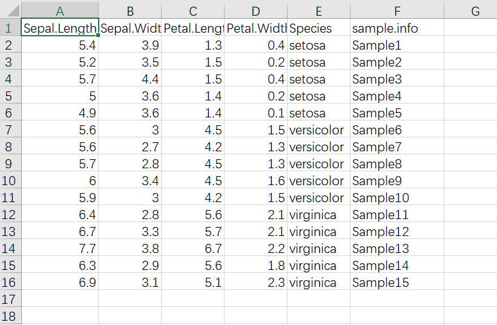

# R语言ggtree树状图

树状图的应用场景可以简单分为两种：一种是聚类分析结果展示的树状图，一种是生物里经常用到的进化树的展示，这两种情况都可以用ggtree俩来展示结果，ggtree是专门用来可视化树状图的ggplot2的扩展包，功能非常强大，细节调整都可以用ggplot2的语法来做。环形的树状图还专门有一个R包ggtreeExtra,可以在树状图周围添加额外的数据

ggtree作者写了非常详细的帮助文档 https://yulab-smu.top/treedata-book/

ggtree的安装需要借助BiocManager

`BiocManager::install("ggtree")`

这个需要R的版本在4.0以上

聚类分析比较常用的是

- 层次聚类

- K均值聚类 （暂时不知道如何用ggtree展示这个结果）

以下介绍层析聚类

示例数据集用鸢尾花iris的数据集，原始数据集有150个样本，3个品种，这里把样本减少，每个品种选5个样本

```
library(tidyverse)
iris %>% group_by(Species) %>% sample_n(5) %>%
  ungroup() %>% 
  mutate(sample.info=paste0("Sample",1:15)) %>% 
  write_csv(file = "example_data/10-treediagram/iris_subset.csv")
```

层次聚类的函数是`hclust()`,
示例数据集截图



层次聚类的代码

```{r}
library(tidyverse)
dat01<-read_csv("example_data/10-treediagram/iris_subset.csv")
head(dat01)
dat01 %>% 
  select(-Species) %>% 
  column_to_rownames("sample.info") -> dat02

dat02 %>% dist() %>% hclust() -> dat02.hclust

library(ggtree)

ggtree(dat02.hclust)

ggtree(dat02.hclust)+
  geom_tiplab()

ggtree(dat02.hclust)+
  geom_tiplab()+
  geom_tippoint()

ggtree(dat02.hclust)+
  geom_tiplab()+
  theme_tree2()

ggtree(dat02.hclust)+
  geom_tiplab()+
  xlim(NA,4)

ggtree(dat02.hclust)+
  geom_tiplab()+
  xlim(NA,4) -> p


p+
  geom_text(aes(label=node))

p +
  geom_highlight(node = 17,fill="red")

p +
  geom_highlight(node = 17,fill="red",extend=4)

p +
  geom_strip(taxa1 = "Sample5",taxa2 = "Sample1",barsize = 5,label = "ABCD",offset = 0.5,color = "green",extend = 1,angle = 90,offset.text = 0.1)

dat01 %>% 
  select(sample.info,Species) %>% 
  rename("label"="sample.info")-> dat03


ggtree(dat02.hclust) -> p

p %<+% dat03 -> p1

ggplot_build(p1)
p1+
  geom_tiplab(aes(color=Species))

p1 +
  geom_tippoint(aes(shape=Species,color=Species),size=5)

ggtree(dat02.hclust,layout = "circular") -> p.circular

p.circular %<+% dat03 -> p1.circular

p1.circular
p1.circular +
  geom_tippoint(aes(color=Species,shape=Species),size=10)
```


## 进化树

进化树最常用到的格式是newick,格式如下


```{r}
library(treeio)
tree<-read.newick("example_data/10-treediagram/example_tree.nwk",
                  node.label = "support")

ggtree(tree)

ggtree(tree,layout = "circular")

ggtree(tree)+
  geom_tiplab()+
  geom_nodelab(aes(label=support))

ggtree(tree)+
  geom_tiplab()+
  geom_nodepoint(aes(size=support))

ggtree(tree)+
  geom_tiplab()+
  geom_nodepoint(aes(size=support))+
  scale_size_continuous(range = c(5,10))
#ggtree(tree,layout = "daylight")
```

## ggtreeExtra添加额外注释信息

```{r}
library(tidyverse)
library(readxl)

dat01<-read_excel("example_data/10-treediagram/tree_extra_info.xlsx")
tree<-read.newick("example_data/10-treediagram/example_tree.nwk",
                  node.label = "support")

ggtree(tree) -> p1
#p %<+% dat01 -> p1
p1

library(ggtreeExtra)
p1+
  geom_tiplab()+
  geom_fruit(data = dat01,
             geom = geom_point,
             mapping = aes(y=ID,size=barplot)
  )+
  geom_fruit(data = dat01,
             geom = geom_bar,
             mapping = aes(y=ID,x=barplot),
             stat="identity",
             orientation = "y",
             axis.params = list(axis="x"),
             grid.params = list())

dat02<-read_excel("example_data/10-treediagram/tree_extra_info.xlsx",
                  sheet = "Sheet2")

p1+
  geom_tiplab()+
  geom_fruit(data = dat01,
             geom = geom_point,
             mapping = aes(y=ID,size=barplot)
  )+
  geom_fruit(data = dat01,
             geom = geom_bar,
             mapping = aes(y=ID,x=barplot),
             stat="identity",
             orientation = "y",
             axis.params = list(axis="x"),
             grid.params = list())+
  geom_fruit(data=dat02,
             geom = geom_tile,
             mapping = aes(y=ID,x=x,fill=value),
             pwidth = 0.1)
```


